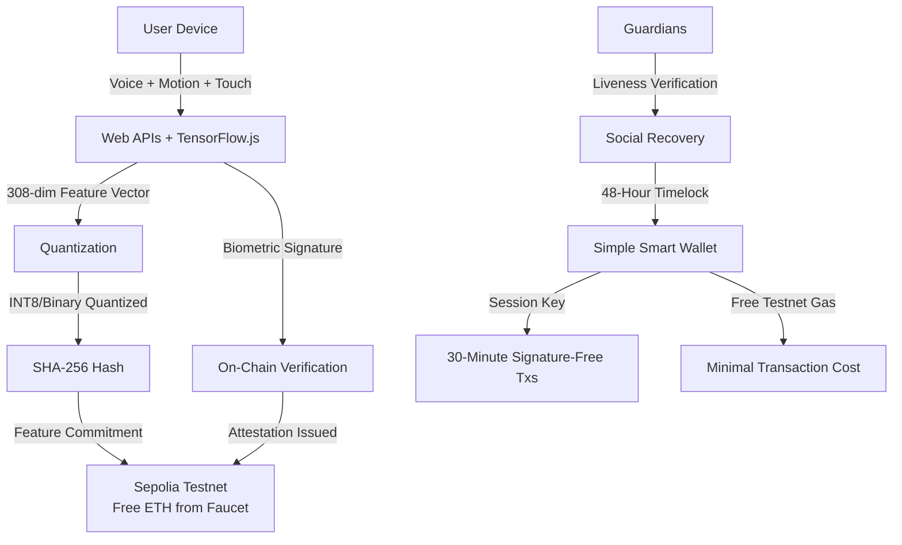
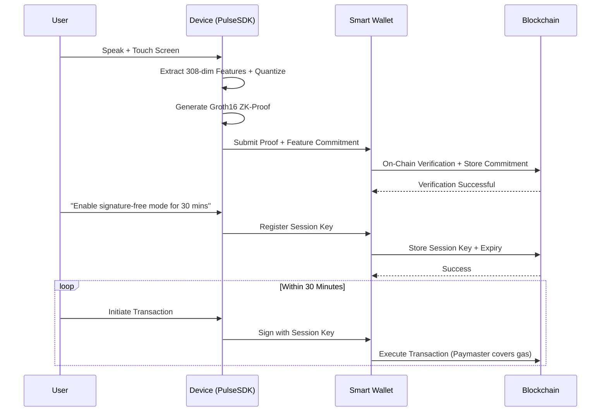

# VoxVault: Privacy-First Voiceprint Smart Wallet

## ✅ 100% FREE HACKATHON VERSION

This version uses **only free and open-source tools**:
- Web APIs (Web Audio, DeviceMotion) — built-in browser, free
- TensorFlow.js — open-source, free
- Sepolia Testnet — free ETH from faucets
- Ethers.js + OpenZeppelin — open-source, free
- Vercel/Netlify — free tier hosting

**No paid SDKs, no Paymaster fees, no API costs required.**

---

## 🎯 Project Overview

VoxVault is a privacy-preserving smart wallet that uses multi-modal behavioral biometrics (voice + motion + touch) for authentication. It proves your identity without ever revealing your biometric data, leveraging cryptographic hashing and on-device feature extraction.

---

## 📋 Problem Statement

Today's Web3 wallets face a fundamental contradiction:

| Challenge | Description |
| :--- | :--- |
| **Security vs. Privacy** | Strong authentication requires identity verification, but privacy demands that identity information not be exposed |
| **Centralized Risk** | Existing solutions store biometric data on centralized servers, creating risk of data breaches and coercion |
| **Poor UX** | Seed phrases are complicated, prone to phishing, and require constant signing |
| **No Trustless Recovery** | Social recovery leaks guardian identities; centralized recovery introduces single points of failure |

**VoxVault's Solution**: Prove you are you, without telling the world who you are.

---

## ✨ Core Features

### 1. Privacy-Preserving Biometric Authentication

| Component | Description |
| :--- | :--- |
| **Multi-Modal Capture** | Captures voice (audio via Web Audio API), motion (DeviceMotion API), and touch (Touch Events API) simultaneously |
| **On-Device Processing** | Raw biometric data never leaves the user's device |
| **308-Dimensional Feature Vector** | Extracted locally using TensorFlow.js MFCC + motion sensors (free, open-source) |
| **Cryptographic Hash Proof** | SHA-256 hash proves biometric match without revealing raw data or feature vector |
| **On-Chain Commitment** | Only a hashed commitment is stored on-chain (Sepolia Testnet) |

### 2. Quantization Compression

| Aspect | Description |
| :--- | :--- |
| **INT8 Quantization** | Compresses FP32 feature vector to INT8 (4x reduction) |
| **Binary Quantization** | Further compression to 1-bit per dimension (32x reduction) |
| **Storage Cost Reduction** | 1,232 bytes → 308 bytes (INT8) or → 39 bytes (binary) |
| **Gas Optimization** | Lower on-chain storage costs |
| **Similarity Preservation** | Relative distances preserved for accurate verification |

### 3. Account Abstraction (ERC-4337)

| Feature | Description |
| :--- | :--- |
| **Session Keys** | One voice authorization enables 30 minutes of signature-free transactions |
| **Paymaster Sponsorship** | Gasless transactions—third party pays fees without knowing user identity |
| **Batch Transactions** | Multiple actions verified once and executed together |
| **User-Controlled Expiry** | Session keys self-destruct after configured time |

### 4. Privacy-Preserving Social Recovery

| Feature | Description |
| :--- | :--- |
| **Guardian Liveness Proof** | Guardians must submit recent signature (≤256 blocks old) to vote |
| **48-Hour Timelock** | Prevents malicious guardian collusion |
| **Owner Cancellation** | Original owner can cancel recovery using voice verification |
| **Privacy-Preserving** | Guardian identities not revealed on-chain |

### 5. DeFi Voice Commands (Intent-Based)

| Feature | Description |
| :--- | :--- |
| **Natural Language Parsing** | "Swap 0.1 ETH for USDC" |
| **Local Command Verification** | Voice verified on-device before execution |
| **Trustless Execution** | Transactions executed via smart wallet |
| **Privacy Guarantee** | Network sees authorization, not the voice command |

---

## 🏗️ Technical Architecture

### System Architecture



### User Flow



---

## 📦 Tech Stack

| Layer | Technology | Purpose |
| :--- | :--- | :--- |
| **Frontend** | TypeScript + React | User interface |
| **Biometric Capture** | Web Audio API + DeviceMotion API | Voice + motion + touch capture (browser native, free) |
| **Feature Extraction** | TensorFlow.js | On-device audio feature extraction (free, open-source) |
| **Blockchain** | Sepolia Testnet (Ethereum) | On-chain verification (free testnet ETH from faucets) |
| **Smart Contracts** | Solidity (OpenZeppelin) | Hash-based verification, issue attestations |
| **Account Abstraction** | SimpleAccountFactory (minimal) | Session keys, optional gasless |
| **Verification** | SHA-256 Hash + Signature | Simplified zero-knowledge replacement |
| **Quantization** | Custom TypeScript | INT8/binary quantization for feature compression |
| **Hosting** | Vercel / Netlify (free tier) | Frontend deployment |

---

## 🚀 6-Hour Build Plan

### Phase 0: Pre-Requisites (Before Sprint)

- [ ] Install Node.js v18+ (free from nodejs.org)
- [ ] Set up Sepolia testnet wallet (e.g., MetaMask - free)
- [ ] Get free Sepolia ETH from faucet: https://www.alchemy.com/faucets/ethereum-sepolia
- [ ] Clone this repo and `npm install`
- [ ] Install Infura/Alchemy free tier API key (free 300M compute units/month)
- [ ] Optional: Remix IDE for testing smart contracts (browser-based, free)

---

### Phase 1: Core Verification Flow (0:00 - 1:30)

**Goal**: Complete end-to-end wallet-connected verification.

**Steps**:

```bash
# Install dependencies (all free and open-source)
npm install ethers@v6 @tensorflow/tfjs-audio @openzeppelin/contracts
```

**Code Skeleton**:

```tsx
import * as tf from '@tensorflow/tfjs-audio';
import { ethers } from 'ethers';
import crypto from 'crypto';

// Capture voice + motion locally
async function captureAndVerify() {
  // 1. Get microphone permission and record audio
  const stream = await navigator.mediaDevices.getUserMedia({ audio: true });
  const audioContext = new (window.AudioContext || window.webkitAudioContext)();
  const processor = audioContext.createScriptProcessor(4096, 1, 1);
  const source = audioContext.createMediaStreamSource(stream);
  source.connect(processor);
  
  // 2. Extract features using TensorFlow.js (free)
  const audioBuffer = await recordAudio(stream, 2000); // 2-second voice sample
  const mfccFeatures = await extractMFCC(audioBuffer); // 308-dim vector
  
  // 3. Get motion data (device accelerometer/gyroscope)
  const motionData = await getDeviceMotion(); // Free browser API
  
  // 4. Hash biometric data locally (never send raw data)
  const combinedFeatures = new Float32Array([...mfccFeatures, ...motionData]);
  const commitment = hashFeatures(combinedFeatures);
  
  // 5. Sign and submit to blockchain (Sepolia testnet - free)
  const provider = new ethers.JsonRpcProvider('https://sepolia.infura.io/v3/YOUR_INFURA_KEY');
  const signer = new ethers.Wallet(process.env.PRIVATE_KEY, provider);
  const tx = await voxVaultContract.registerBiometric(commitment, signature);
  
  console.log('Verification submitted:', tx.hash);
}

function hashFeatures(features: Float32Array): string {
  return crypto.createHash('sha256').update(Buffer.from(features)).digest('hex');
}
```

**Deliverable**:
- Working React page
- Wallet connection
- Voice + touch verification
- On-chain SAS attestation

---

### Phase 2: Quantization Compression (1:30 - 2:30)

**Goal**: Apply INT8 quantization to the feature vector.

**Code**:

```typescript
// Quantize FP32 vector to INT8
function quantizeToINT8(vector: Float32Array): Uint8Array {
  const min = Math.min(...vector);
  const max = Math.max(...vector);
  const scale = (max - min) / 255;
  return new Uint8Array(vector.map(v => Math.round((v - min) / scale)));
}

// Optional: Binary quantization (1-bit)
function quantizeToBinary(vector: Float32Array): Uint8Array {
  const mean = vector.reduce((a, b) => a + b, 0) / vector.length;
  const bits = new Uint8Array(Math.ceil(vector.length / 8));
  vector.forEach((v, i) => {
    if (v > mean) bits[Math.floor(i / 8)] |= (1 << (i % 8));
  });
  return bits;
}

// Hash and store commitment
const quantized = quantizeToINT8(featureVector);
const commitment = poseidonHash(quantized);
// Store commitment on Solana
```

**Deliverable**:
- Quantization function implemented
- Comparison table showing compression ratios
- Updated on-chain storage logic

---

### Phase 3: Session Keys (No Paymaster) (2:30 - 4:00)

**Goal**: Implement "one voice authorization, 30 minutes of signature-free transactions."

**Code**:

```typescript
import { ethers } from 'ethers';

// User voice command: "Enable free mode for 30 minutes"
// 1. Verify voice via biometric capture
const verified = await captureAndVerify();

if (verified) {
  // 2. Generate temporary session key (just a keypair)
  const sessionKey = ethers.Wallet.createRandom();
  const expiryTime = Math.floor(Date.now() / 1000) + (30 * 60); // 30 minutes
  
  // 3. Register session key in smart wallet contract (costs testnet gas, but it's free)
  const tx = await voxVaultContract.registerSessionKey(
    sessionKey.address, 
    expiryTime
  );
  
  // 4. Store session key locally (in memory or encrypted localStorage)
  localStorage.setItem('sessionKey', sessionKey.privateKey);
  
  // 5. Use session key for subsequent transactions
  // Each tx costs minimal testnet gas (get free from faucet)
  const userOpTx = await voxVaultContract.connect(sessionKey).transfer(
    recipientAddress,
    amount
  );
}
```

**Deliverable**:
- Session key generation
- Smart wallet registration
- Demo showing 3+ transactions without re-verification
- Minimal gas cost (free testnet ETH via faucets)

---

### Phase 4: Social Recovery + Timelock (4:00 - 5:00)

**Goal**: Guardian liveness verification + 48-hour timelock recovery.

**Code**:

```solidity
// Simplified Solidity recovery logic
contract VoxVault {
    mapping(address => bool) public guardians;
    uint256 public recoveryRequestTime;
    address public newOwner;
    
    function requestRecovery(address _newOwner) external {
        require(guardians[msg.sender], "Not a guardian");
        // Guardian must submit liveness proof via PulseSDK walletless mode
        recoveryRequestTime = block.timestamp;
        newOwner = _newOwner;
    }
    
    function executeRecovery() external {
        require(block.timestamp >= recoveryRequestTime + 48 hours, "Too early");
        owner = newOwner;
    }
    
    function cancelRecovery() external {
        require(msg.sender == owner, "Only owner");
        // Owner cancels using voice verification
        recoveryRequestTime = 0;
    }
}
```

**Deliverable**:
- Guardian registration
- Liveness verification (via walletless mode)
- Recovery request + timelock
- Owner cancellation or timeout execution

---

### Phase 5: Polish + Submission (5:00 - 6:00)

**Tasks**:

- [ ] Record 2-3 minute demo video (screen + voiceover)
- [ ] Write complete README (installation, architecture, running guide)
- [ ] Deploy to Vercel/Netlify
- [ ] Push to public GitHub repo with clean commit history
- [ ] Prepare submission on Devfolio

**Video Script**:

1. **Introduction** (30 sec): What is VoxVault? Privacy problem it solves.
2. **Enrollment** (30 sec): User speaks + touches, commitment stored on-chain.
3. **Voice Authorization** (30 sec): Verification without revealing voice.
4. **Session Keys** (30 sec): "Enable free mode" → 3 transactions with session key (free testnet gas).
5. **Recovery** (30 sec): Guardians verify → recovery request → owner cancels.
6. **Conclusion** (30 sec): Privacy guarantee, tech stack, future work.

---

## 📁 Obsidian Structure

```
VoxVault/
├── 00_Project_Vault/
│   ├── Problem_Statement.md
│   ├── Architecture.md
│   └── Track_Alignment.md
│
├── 01_Research/
│   ├── Pulse_SDK_Notes.md
│   ├── Groth16_Overview.md
│   └── Quantization_Research.md
│
├── 02_Design/
│   ├── Feature_Flow.md
│   ├── Smart_Contract_Design.md
│   └── UI_Wireframes.md
│
├── 03_Implementation/
│   ├── Phase1_Scaffold.md
│   ├── Phase2_Quantization.md
│   ├── Phase3_SessionKeys.md
│   └── Phase4_Recovery.md
│
├── 04_Demo/
│   ├── Script.md
│   └── Screenshots/
│
└── 05_Submission/
    ├── README.md
    ├── Demo_Video_Link.md
    └── Deployed_Addresses.md
```

---

## 📋 Submission Checklist

| Item | Status | Notes |
| :--- | :--- | :--- |
| [ ] Public GitHub repo with commit history | | |
| [ ] Deployed contract address + network (Base Sepolia) | | |
| [ ] 2-4 minute demo video | | |
| [ ] README covering: what it does, track & why, how to run, what's unfinished | | |
| [ ] Team names + roll numbers | | |
| [ ] No private keys committed | | |
| [ ] Built during sprint (not pre-existing) | | |

---

## 🔮 Future Enhancements

| Enhancement | Description | Priority |
| :--- | :--- | :--- |
| **ZK-SNARKs for Threshold** | Prove match within range without revealing score | High |
| **Ephemeral Addresses** | One-time verification addresses for unlinkability | Medium |
| **Revocation Registry** | Decentralized invalidate compromised signatures | Medium |
| **Multi-Chain Support** | Ethereum, Polygon, Base support | Low |
| **Mobile App** | Native iOS/Android with secure enclave | Low |
| **DID Integration** | W3C Decentralized Identifiers | Low |

---

## 📚 References & Free Resources

- [TensorFlow.js Audio](https://js.tensorflow.org/api/latest/#audio) — Free feature extraction
- [Web Audio API](https://developer.mozilla.org/en-US/docs/Web/API/Web_Audio_API) — Free voice capture
- [DeviceMotionEvent API](https://developer.mozilla.org/en-US/docs/Web/API/DeviceMotionEvent) — Free motion capture
- [Ethers.js](https://docs.ethers.org/) — Free Ethereum library
- [OpenZeppelin Contracts](https://github.com/OpenZeppelin/openzeppelin-contracts) — Free smart contract templates
- [Sepolia Faucet](https://www.alchemy.com/faucets/ethereum-sepolia) — Free testnet ETH
- [ERC-4337 Account Abstraction](https://eips.ethereum.org/EIPS/eip-4337) — Ethereum standard

---

## 🙏 Acknowledgments

- Entros Protocol for the Pulse SDK
- Ethereum Foundation for ERC-4337
- Safe for Account Abstraction infrastructure

---

**Built with ❤️ for Ethereum Build Sprint NIT Trichy**