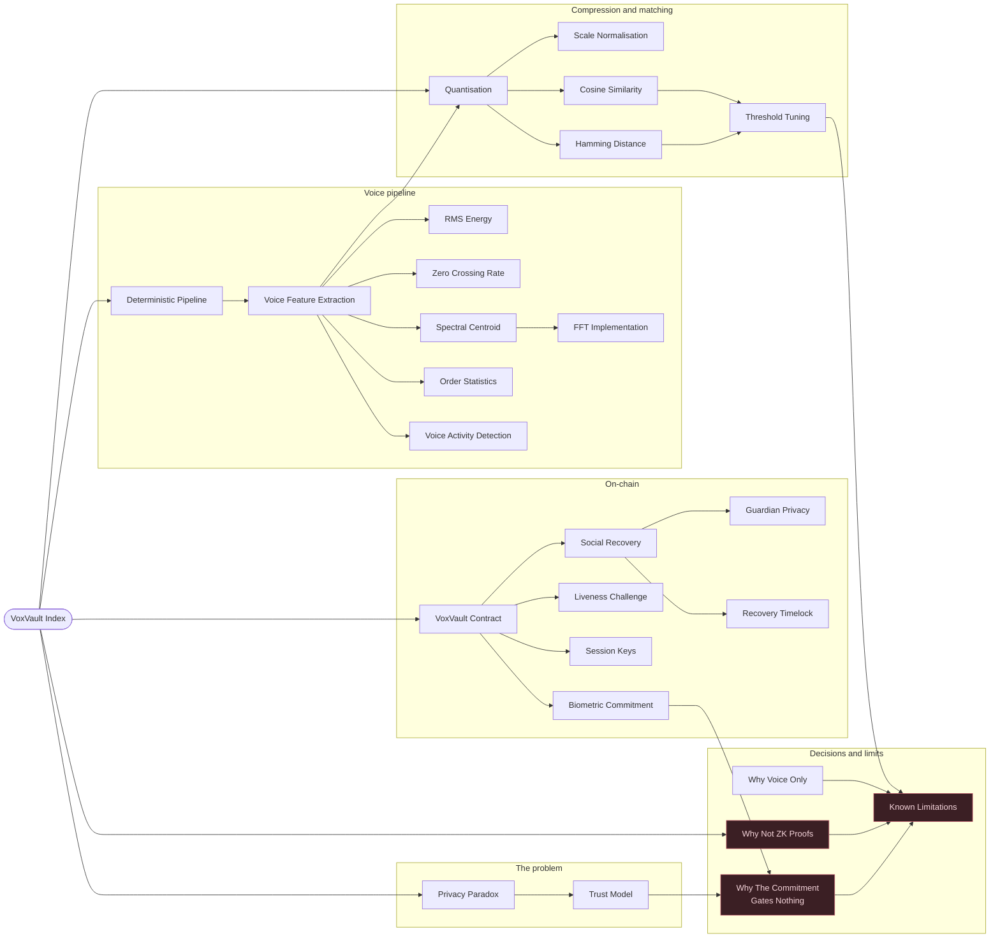

<div align="center">

# 🔐 AegisVox

**A smart wallet you authorise with your voice.**

Audio is analysed entirely in the browser and never uploaded — only a 32-byte commitment ever reaches the chain.

[](https://sepolia.etherscan.io)
[](contracts/)
[](frontend/)
[](contracts/test/VoxVault.test.ts)
[](LICENSE)

Built by **Team Congnivista** for the Ethereum Build Sprint · NIT Trichy

**[Problem Statement](PROBLEM_STATEMENT.md) · [Demo Pitch Script](DEMO_PITCH_SCRIPT.md) · [Design Vault](vault/)**

</div>

---

## Table of Contents

- [Overview](#overview)
- [Track: Privacy](#track-privacy)
- [Deployed Contracts](#deployed-contracts)
- [How It Works](#how-it-works)
- [Security & Trust Model](#security--trust-model)
- [Quickstart — Run It Locally](#quickstart--run-it-locally)
- [The Voice Pipeline](#the-voice-pipeline)
- [Architecture](#architecture)
- [Testing](#testing)
- [What's Broken / Unfinished](#whats-broken--unfinished)
- [License](#license)

---

## Overview

AegisVox is a voice-authorised smart wallet. Instead of signing every transaction with a hardware key or seed phrase, you speak a passphrase; the browser turns that into a feature vector, matches it locally against an enrolled template, and — on a pass — unlocks a short-lived session key that can transact on your behalf without further signing prompts.

Nothing about the voice itself ever leaves your device. What reaches Sepolia is a tamper-evident trail: a commitment hash at enrolment, an event per verification attempt, and ordinary ECDSA authorisation underneath it all.

| Capability | Summary |
|---|---|
| 🎙️ **Voice enrolment** | 48-dimensional feature vector extracted client-side, only its hash is published |
| 🔁 **Voice verification** | Fresh sample compared against the stored template, entirely in-browser |
| 🎲 **Liveness challenge** | On-chain random digits must be spoken back, defeating stale recordings |
| 🗝️ **Session keys** | One passing verification unlocks a throwaway keypair with an expiry — zero signing prompts until it lapses |
| 🛡️ **Social recovery** | Guardians stored as `keccak256(address, salt)`, gated by a cancellable timelock |

---

## Track: Privacy

**AegisVox is built for the Privacy track**, because privacy isn't a checkbox feature bolted on at the end — it's the constraint that shaped every design decision:

- **Biometric data never leaves the device.** All feature extraction and matching happen client-side. The one thing that ever reaches the chain is a SHA-256 commitment — a one-way hash a third party cannot invert back into a voiceprint.
- **Guardian identities are hidden until they act.** Recovery guardians are stored as `keccak256(address, salt)`, not raw addresses — so simply *being* a guardian reveals nothing on-chain.
- **We rejected the "more powerful" design because it leaked privacy.** An on-chain fuzzy-matching approach (storing the quantised vector and computing Hamming distance in Solidity) was considered and explicitly rejected: it would work better, but it publishes a replayable biometric template forever. We chose the privacy-preserving path even though it was the harder engineering problem.
- **Users control disclosure, not us.** There's no server, no database, no company custodian of anyone's voice. The only party who ever holds the biometric template is the user's own browser session.
- **The one deliberate exception is disclosed, not hidden.** Liveness-challenge transcription uses Chrome's cloud-based `SpeechRecognition` API — see [Security & Trust Model](#security--trust-model) for exactly what that does and doesn't expose.

This is what makes AegisVox a privacy project rather than just a biometrics demo: every place we could have traded privacy for convenience or accuracy, we picked privacy — and documented the trade-off instead of hiding it.

---

## Deployed Contracts

Both instances share identical, verified bytecode on **Sepolia** — only the timing parameters differ.

| Instance | Address | Session Key TTL | Recovery Timelock | Purpose |
|---|---|---|---|---|
| **main** | [`0xEaAcab7C3A8771651987FAa0142E1Cef59BFF62B`](https://sepolia.etherscan.io/address/0xEaAcab7C3A8771651987FAa0142E1Cef59BFF62B) | 30 min | 48 h | The real configuration |
| **demo** | [`0x4e93fAEE4D9A5eFa0a53C21c40e1Cb0605308a29`](https://sepolia.etherscan.io/address/0x4e93fAEE4D9A5eFa0a53C21c40e1Cb0605308a29) | 2 min | 3 min | So `request → wait → execute` can be shown live |

---

## How It Works

1. **Enrol** — say a short passphrase. The browser extracts a 48-dimensional feature vector from the audio, hashes it, and publishes only the hash.
2. **Verify** — say it again. The new vector is compared against the stored one, in-browser. A pass unlocks actions in the UI.
3. **Liveness challenge** — the contract issues a four-digit number. You speak it aloud with your passphrase; the browser transcribes it and mixes it into the commitment. A recording made *before* the number existed can't contain it, so replay fails.
4. **Session keys** — one passing verification registers a throwaway keypair on-chain with an expiry. Transact freely until it lapses — no signing prompts.
5. **Social recovery** — guardians are stored as `keccak256(address, salt)`, so adding one never publishes their address. A guardian can open a recovery; a timelock delays it; the owner can cancel in the meantime.

---

## Security & Trust Model

AegisVox is built on a simple principle: **biometrics decide what you're willing to attempt; cryptography decides what's allowed to happen.** Voice drives the experience, while every on-chain action is still backed by standard, audited authorisation primitives.

| Layer | Mechanism | Guarantee |
|---|---|---|
| **On-chain authorisation** | ECDSA — `onlyOwner` or an unexpired session key | Only cryptographic signatures ever move funds; a regression test pins this against a past design that would have let a malicious recovery go uncancellable |
| **Replay defence** | Single-use, five-minute-expiry liveness challenges | A pre-recorded sample can never contain a challenge number that didn't exist yet when it was recorded |
| **Guardian privacy** | `keccak256(address, salt)` commitments | Guardian identities stay off-chain until the moment they choose to act |
| **Recovery safety** | Time-locked recovery with owner-side cancellation | A compromised guardian can't unilaterally seize the wallet — the clock gives the owner a window to intervene |
| **Template privacy** | Only a SHA-256 commitment of the voice vector is published | The raw biometric template never touches the chain, so it can never be scraped, leaked, or replayed from public state |

**Transparent by design, not by accident.** Rather than hiding behind a pass/fail badge, the UI surfaces the raw Hamming distance and cosine similarity on every verification attempt, with an adjustable threshold — so the matching decision is auditable in real time, not a black box.

**Defence in depth.** Enrolment, verification, liveness, session keys, and recovery are independent subsystems: a weakness in one (say, browser-based voice matching) never escalates into control over the others, because the contract layer never trusts voice data directly — it only trusts signatures and time.

---

## Quickstart — Run It Locally

Requires **Node 20+** and a browser with MetaMask.

```bash
npm install
npm run compile -w contracts   # also copies the ABI into the frontend
npm run test -w contracts      # 37 tests
```

Deploy to Sepolia — put credentials in `contracts/.env` first (see `.env.example`; a burner key is strongly advised):

```bash
npm run deploy -w contracts
```

This deploys two instances of identical bytecode (see [Deployed Contracts](#deployed-contracts)). Addresses are written to `contracts/deployments/sepolia.json`. Put the one you want in `frontend/.env.local`:

```bash
cp frontend/.env.example frontend/.env.local
# VITE_CONTRACT_ADDRESS=0x...
npm run dev -w frontend
```

> ⚠️ The microphone requires a **secure context** — `localhost` works; a plain-HTTP LAN address does not.

---

## The Voice Pipeline

`frontend/src/lib/biometrics.ts` — deterministic end to end: the same audio always yields the same vector.

1. Record, downmix to mono, scale so the peak sample is 1.0 — without normalisation, features would just track how far you sat from the mic.
2. Split into 1024-sample frames at 50% overlap.
3. Drop frames below 12% of peak RMS, so statistics describe speech rather than surrounding silence.
4. Per frame: compute RMS energy, zero-crossing rate, and spectral centroid over a hand-written radix-2 FFT.
5. Collapse each series — and its frame-to-frame difference — into 8 order statistics (mean, std, min, max, median, range, p25, p75).

**3 features × 2 series × 8 statistics = 48 dimensions.**

Order statistics are what make this work at all: two readings of the same phrase are never the same length or speed, so anything frame-aligned would fail. Order statistics sidestep alignment entirely.

Dimensions live on very different scales — RMS is ~0–1, spectral centroid runs to thousands of hertz — so `quantization.ts` applies fixed per-dimension divisors before any quantisation or distance computation. Without that step, mean-threshold binary quantisation would be decided almost entirely by the centroid dimensions.

**Compression:** 48 float32 dims = 192 bytes → 48 bytes at INT8 → 6 bytes binary.

---

## Architecture


<p align="center"><em>The full system, mapped as a knowledge graph — every module, decision, and trade-off, linked back to what it connects to.</em></p>


*Exception: the liveness digits pass through Chrome's `SpeechRecognition` for transcription — see [Security & Trust Model](#security--trust-model).*

```
contracts/
  contracts/VoxVault.sol      ownership, commitment, session keys, recovery
  test/VoxVault.test.ts       37 tests
  scripts/deploy.ts           two-instance deploy + Etherscan verification
frontend/src/
  lib/biometrics.ts           capture, FFT, feature extraction
  lib/quantization.ts         scale normalisation, INT8/binary, distances
  lib/hashing.ts              SHA-256 commitments via ethers
  lib/sessionKey.ts           ephemeral keypair in sessionStorage
  lib/contract.ts             typed contract access, guardian commitments
  components/                 biometric, session key and recovery panels
```

---

## Testing

```bash
npm run test -w contracts   # 37 tests
```

Coverage includes: session key expiry and revocation; recovery timelock boundaries either side of the deadline via time travel; guardian salt verification (right salt, wrong salt, non-guardian); the liveness challenge (single-use consumption, stale challenge values, expiry, and logging of failed attempts); and the `cancelRecovery` regression described above.

There are no frontend tests. Given the time budget, contract correctness was worth more than component coverage — the contract is what holds funds.

---

## What's Broken / Unfinished

AegisVox's core loop — enrol, verify, transact, recover — runs end-to-end on Sepolia with 37 passing contract tests. A few things are still on the punch list:

- **Guardian anonymity is partial** — addresses stay private until a guardian actually initiates recovery; a relayer would close that last gap.
- **M-of-N guardian thresholds** — the contract already models `guardianThreshold`; the UI only exposes single-guardian recovery so far.
- **No frontend test suite yet** — time was spent prioritising the 37 contract tests, since the contract is what holds funds.

Everything else — commitment scheme, session keys, liveness challenge, recovery timelock — is implemented and tested.

---

## License

Released under the [MIT License](LICENSE).

<div align="center">

**Team Congnivista** · Ethereum Build Sprint, NIT Trichy

</div>
